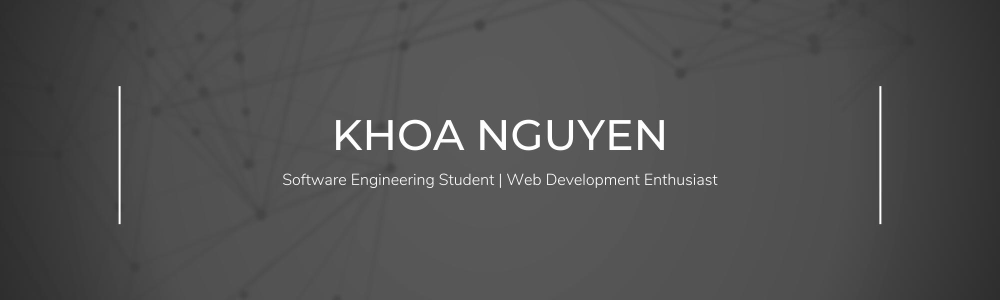

As a software engineering student, I am highly interested in web development - focusing on the frontend. My objective is to create web applications that are scalable, manageable, and user-friendly while providing a smooth user experience. I am continuously improving my skills by learning and trying out new technologies and frameworks to find the most effective solutions for the challenges I encounter.

##

 
<!-- Work illustrations by Storyset: https://storyset.com/work -->

 

- 🔭 I’m a **Bachelor Student** major in **Software Engineering**, based in **Finland**.

- 🌱 I’m currently learning **Fullstack Development**.

- 📫 How to reach me **nhkhoa020400@gmail.com**.

- 📄 Know about my **[experiences](linkedin.com/in/khoahng)**!

- ⚡ Fun fact I do **[Game Development](https://hkhoa.itch.io/)**!

- 🖼️ Check out my **[Portfolio](https://hkhoa-ng.github.io/hkhoa-ng-portfolio/)**!

 
 

#

 

<h2 align="center">📫 Connect with me</h2>

    
&nbsp;
&nbsp;

 
<h2 align="center">📊 Github Stats</h2>

 

<h2 align="center">🛠️ Languages and Tools</h2>

<b>🏄‍♂️ Frontend</b>

 
  
&nbsp;
&nbsp;
&nbsp;
&nbsp;

<b>🧰 Backend & Cloud</b>

 

&nbsp;
&nbsp;
&nbsp;
&nbsp;
&nbsp;

<b>🗄️ Database</b>

 

&nbsp;
&nbsp;
&nbsp;

<b>💻 Software and Tools</b>

 

&nbsp;
&nbsp;
&nbsp;
&nbsp;
 
&nbsp;
&nbsp;
&nbsp;
&nbsp;

 

<h2 align="center">👨‍💻 My GitHub Projects</h2>
 
&nbsp;
&nbsp;
&nbsp;
&nbsp;
&nbsp;
&nbsp;
&nbsp;
&nbsp;

<!-- BLOG-POST-LIST:START -->
